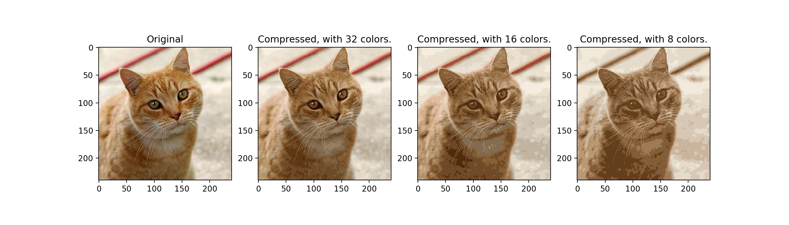
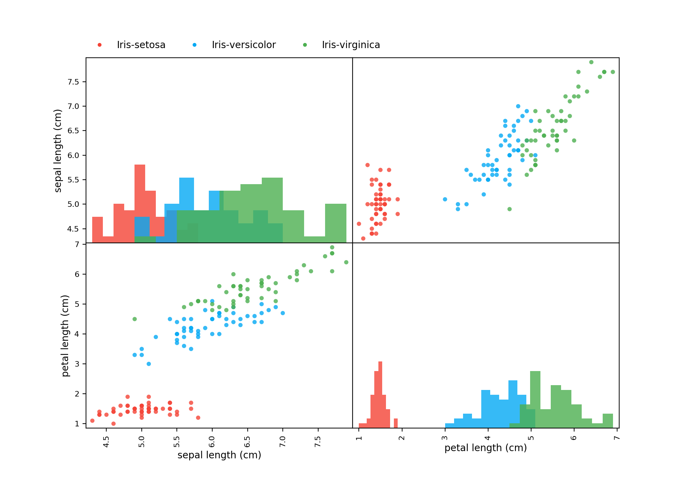
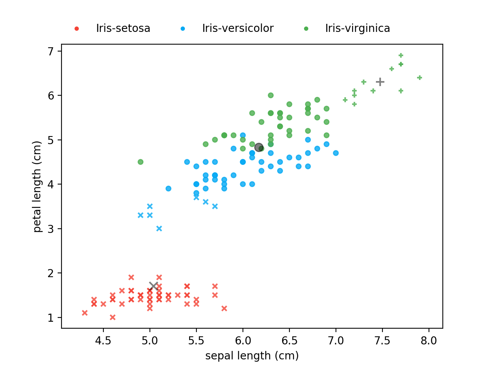
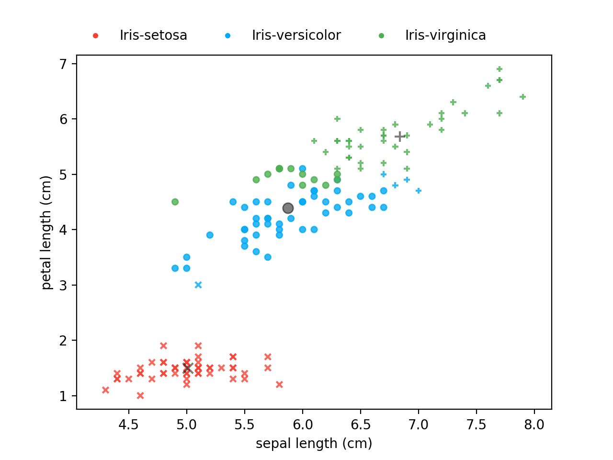
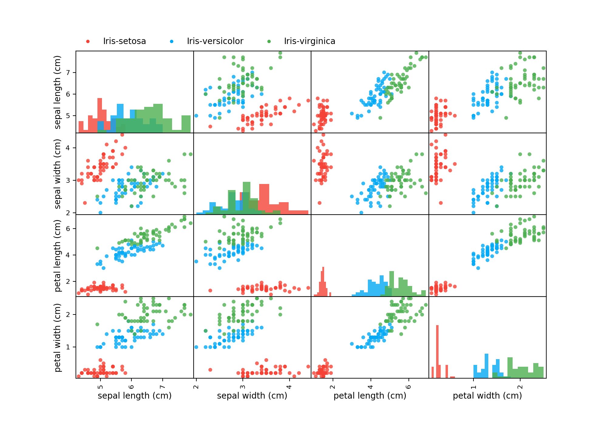
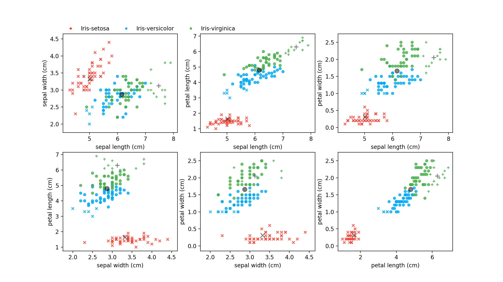
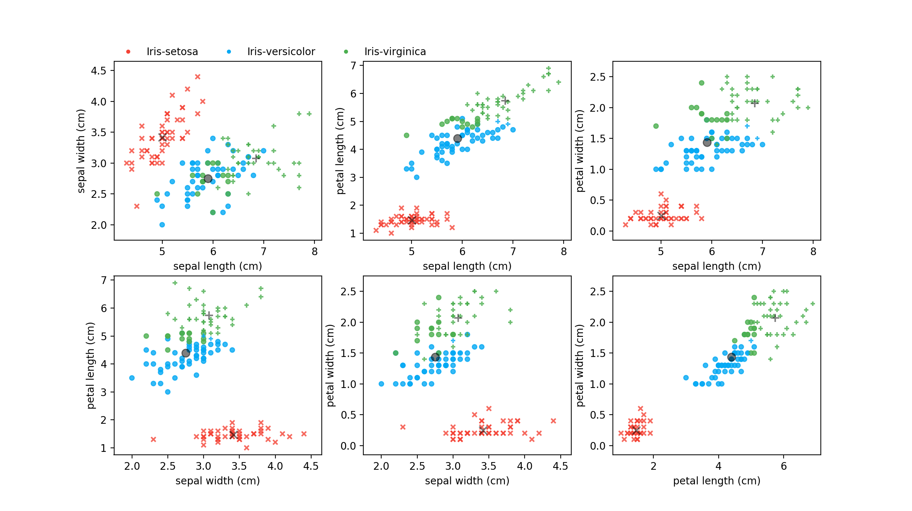

# K-Means_Compression

About
-----
> K-Means Implementation in numpy for Image Compression

Installation
------------
Run `make install`

Usage
-----
`python3 pixels.py [-h] [--rand rand] iter K image`
* `-h`: Show help message and exit.
* `--rand`: Random state (integer).
* `iter`: Maximum number of iteration.
* `K`: Number of clusters.
* `image`: Path to the image we want to compress.

`python3 iris.py [-h] [--rand rand] [--full] iter K`
* `-h`: Show help message and exit.
* `--rand`: Random state (integer).
* `--full`: Enable full mode. (Use the 4 features in the dataset)
* `iter`: Maximum number of iteration.
* `K`: Number of clusters.

Example
-------
### K-Means for Image Compression

Run `python3 pixels.py 25 16 ./data/cat.jpg` to compressed with `16` colors.

Here's some compression with `K=32`, `K=16` and `K=8`.
<div align="center">
  
</div>

### K-Means on Iris dataset
`python3 iris.py 10 3 --rand 4`
<div align="center">
  
</div>

```
# Iteration: 0 -- Cost: 0.5164797379250595
[...]
# Iteration: 9 -- Cost: 0.35867567462084354
Cannot optimize more.
```

<div align="center">
  
  
</div>

_Scatter plot with cluster centroid at iteration 0 (left), and at the last iteration (right)._

`python3 iris.py 10 3 --rand 4 --full`
<div align="center">
  
</div>

```
# Iteration: 0 -- Cost: 0.7395218912011681
[...]
# Iteration: 5 -- Cost: 0.5262722761743066
Cannot optimize more.
```

<div align="center">
  
  
</div>

_Scatter plot with cluster centroid at iteration 0 (left), and at the last iteration (right)._

##### Project done in 2019
